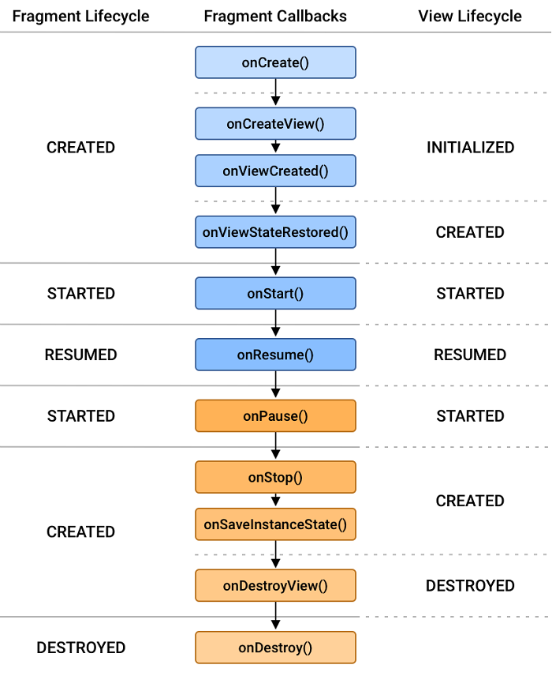

# Table of contents

[1. Introducation](#introduction)

[2. App Components](#app-components)

[3. Intent](#intent)

[4. Activities](#activities)

[5. Fragments](#fragments)

[6. Services](#services)

[7. Broadcast](#broadcast)

[8. Data Persistance](#data-persistance)

[9. Room Database](#room-database)

[10. Multithreading](#multithreading)

[11. AsyncTask](#asynctask)

[12. Retrofit](#retrofit)

[13. Button Listeners](#button-listeners)

[14. Dialogs](#dialogs)

[15. Notification](#notification)

[16. Permissions](#permissions)

[17. API Keys](#api-keys)

[18. AlarmManager](#alarmmanager)

[19. WorkManager](#workmanager)

[20. ViewModel](#viewmodel-and-livedata)

[21. Jetpack Compose](#jetpack-compose)

# Introduction

Android is an **open-source operating system** primarily designed for mobile devices such as smartphones and tablets.

It is based on the **Linux kernel** and developed by a consortium of developers known as the Open Handset Alliance, **led by Google**.

Android is written in **Java** and Kotlin programming languages.

## Gradle

Android Studio IDE uses **Gradle** as its build system.

Gradle is a powerful and flexible build automation tool used in software development, particularly in the Java and Android ecosystems.

It is designed to manage the **build lifecycle of projects**, _automate_ the **compilation and packaging processes**, and **handle dependencies** efficiently.

Gradle is the tool working behind the scenes to **compile and package your app**.

It **looks at the dependencies** you _declared in your build.gradle_ files and creates a build script accordingly.

## SDK

SDK stands for Software Development Kit.

It is a set of tools, libraries, and documentation that developers use to create software applications for specific platforms.

## Performance Issues

ANR

- Application Not Responding
- Long Running Tasks in UI thread

Crash

- When an exception is not handled properly

Memory Leaks

- When an object is no longer needed, but it is still referenced by other objects.
- When Garbage collector does not free up an object in your app that can't be used anymore
- **Solution**: Use LeakCanary library

## Multi Module App

It is a Practice of breaking the concept of a monolithic, one-module codebase into loosely coupled, self contained modules.

There are two ways of Modularization:

1. Modularization by Layer
2. Modularization by Feature

> But to make a better app, we can use Modularization by Layer and Feature, both
>
> Making the app scalable
>
> Some Modules are => `:app`, `:feature:foryou`, `:core:data`, `:core:datastore`, `:core:network`, `:build-plugins`

There are three features of a good app architecture:

1. Cohesion - Modules have Well Defined Responsibilities
2. Coupling - Modules have Least Dependancy on Other Modules
3. Granularity - The extent to which the codebase is composed of modules

## Reducing App Size and Securing the App

To make your app as small as possible, you should enable `shrinking` in your release build to remove unused code and resources.

When enabling `shrinking` :

- you also benefit from **obfuscation**, which shortens the names of your app’s classes and members
- and **optimization**, which applies more aggressive strategies to further reduce the size of your app.

# App Components

App components are the essential **building blocks** of an Android app.

Each component is an **entry point through which the user can enter** your app.

There are **four** main components, **Each type serves a distinct purpose and has a distinct lifecycle** that defines how a component is created and destroyed.

## Activity

An activity is the **entry point** for interacting with the user.

It represents a **single screen** with a user interface.

## Service

A service is a **general-purpose entry point** for keeping an app running in the background for all kinds of reasons.

It is a **component that runs in the background** to perform **long-running operations** or to perform work for **remote processes**.

It **does not** provide a **user interface**.

- A service might **play music in the background** while the user is in a different app
- It might **fetch data over the network** without blocking user interaction with an activity

there are **two types of services** that **tell the system how to manage an app**:

### Started Services

A **started service** is one that **another component starts** by calling `startService()`, which results in a call to the service's `onStartCommand()` method.

It tell the system to keep them running **until their work is completed**.

Once started, a service can **run in the background indefinitely**, even if the component that started it is destroyed.

Usually, a started service performs a **single operation** and **does not return a result** to the caller.

For example, it might **download or upload a file** over the network.

When the operation is done, the service should **stop itself**.

> If a component starts the service by calling `startService()` (which results in a call to `onStartCommand()`), the service continues to run until it stops itself with `stopSelf()` or another component stops it by calling `stopService()`.

### Bound Services

A **bound service** is one that **another component binds to** by calling `bindService()`, which allows the client to **interact with the service**, send requests and receive results.

A bound service **runs only as long as another application component** is bound to it.

Multiple components can **bind to the service at once**, but when all of them unbind, the service is destroyed.

> f a component calls `bindService()` to create the service and `onStartCommand()` is not called, the service runs only as long as the component is bound to it. After the service is unbound from all of its clients, the system destroys it.

## Broadcast Receivers

A broadcast receiver is a **component that enables the system to deliver events to the app outside of a regular user flow** so the app can respond to system-wide broadcast announcements.

The system can deliver broadcasts even to apps that aren't currently running.

## Content Providers

A content provider manages a **shared set of app data** that you can store in the file system, in a SQLite database, on the web, or on any other persistent storage location that your app can access.

Through the content provider, other apps can query or modify the data, if the content provider permits it.

## Context

Context is an object that provides information about the **current state of the application** and facilitates **access to application resources and system-level operations**.

For example,

**It is used for accessing Resources**

```java
// Accessing a string resource
String appName = context.getString(R.string.app_name);
```

**It is used for accessing System Services**

```java
// Accessing the Alarm Service
AlarmManager alarmManager = getSystemService(AlarmManager.class);
```

**It is used for accessing App Components**

```java
// Starting an Activity
Intent intent = new Intent(context, MainActivity.class);
context.startActivity(intent);
```

# Intent

An **asynchronous message** called an intent activates three of the four component types: activities, services, and broadcast receivers.

It is a **messaging object** used to request an operation or to communicate between components in an Android application.

## Explicit Intent

An explicit intent is one that you use to launch a **specific app component**, such as a particular activity or service in our app or in the other app.

```java
Intent intent = new Intent(this, SecondActivity.class);
startActivity(intent);
```

```java
Intent intent = new Intent(Intent.ACTION_VIEW);
intent.setData(Uri.parse("https://www.youtube.com/watch?v=2hIY1xuImuQ"));
intent.setPackage("com.google.android.youtube");
startActivity(intent);
```

## Implicit Intent

An implicit intent is one that the system uses to **determine which component to start** by comparing the contents of the intent to the intent filters declared in the manifest file of other apps on the device.

```java
Intent intent = new Intent();
intent.setAction(Intent.ACTION_SEND);

// This shows the apps that accept an Intent Sending Text
intent.setType("text/plain");

intent.putExtra(Intent.EXTRA_EMAIL, new String[]{"ripalnakiya@gmail.com"});
intent.putExtra(Intent.EXTRA_SUBJECT, "Email Subject");
intent.putExtra(Intent.EXTRA_TEXT, "Hello, This is Sample Mail");

// Chooser shows list of all the apps that can handle text sharing
String chooserTitle = "Share this Text with";
Intent chooser = Intent.createChooser(intent, chooserTitle);

// startActivity(intent);
startActivity(chooser);
```

**Accepting an implicit intent**

Firstly, add this intent filter in the manifest file of the activity that you want to launch.

```xml
<intent-filter>
    <action android:name="android.intent.action.SEND"/>
    <category android:name="android.intent.category.DEFAULT"/>
    <data android:mimeType="text/plain"/>
</intent-filter>
```

```java
Intent intent = getIntent();

String Iemail = Arrays.toString(intent.getStringArrayExtra(Intent.EXTRA_EMAIL)) ;
String Isubject = intent.getStringExtra(Intent.EXTRA_SUBJECT);
String Ibody = intent.getStringExtra(Intent.EXTRA_TEXT);
```

## Pending Intent

A PendingIntent in Android **is a token** that you give to a **foreign application** (e.g., NotificationManager, AlarmManager, AppWidgetManager, etc.) to allow it to execute a specific piece of code on your behalf.

Pending Intent is same as Intent, but to be triggered at later point in time by some one else (Operating System)

```java
Intent intent = new Intent(context, MyActivity.class);
PendingIntent pendingIntent = PendingIntent.getActivity(context, 0, intent, 0);
```

> You can create a PendingIntent using methods like `getActivity()`, `getService()`, or `getBroadcast()` in the `PendingIntent` class.

# Activities

Activity is a single, focused thing that the user can do.

It represents a single screen with a user interface.

Almost all activities interact with the user, so the Activity class takes care of creating a window for you in which you can place your UI with setContentView(View).

## Activity Lifecycle


The Activity class provides the following callbacks that you can override to perform actions when the corresponding event occurs:

- **onCreate()** : It is called when the activity is first **created**, and it **initializes the essential components** of your activity, for example it **defines the UI** of the Activity.

- **onStart()** : As `onCreate()` exits, the activity enters the Started state, and the **activity becomes visible to the user**.

- **onResume()** : The system invokes this callback just **before the activity starts interacting** with the user. The activity is at the **top of the activity stack**, and captures all user input.

- **onPause()** : The system calls `onPause()` **when the activity loses focus** and enters a Paused state. for example, the **user taps the Back or Recents button**. When the system calls onPause() for your activity, it technically means your **activity is still partially visible**.

- **onStop()** : The system calls `onStop()` when the **activity is no longer visible to the user**.

- **onRestart()** : The system invokes this callback when an activity in the Stopped state is about to restart. `onRestart()` **restores the state of the activity** from the time that it was stopped.

- **onDestroy()** : The system invokes this callback **before an activity is destroyed**. `onDestroy()` is usually implemented to ensure that** all of an activity’s resources are released** when the activity is destroyed.

## Scenario 1 : Single Activity - User Navigates Away

> **Triggered By :**
>
> User presses the Home button
>
> User switches to another app (From Notification or Accepting a call)

**App Started :**

- onCreate()
- onStart()
- onResume()

**Home Button Pressed :**

- onPause()
- onStop()
- **onSaveInstanceState()**

**App Restarted :**

- onRestart()
- onStart()
- onResume()

> When the user taps the Overview (Recent Apps) or Home button, the system behaves as if the current activity has been completely covered.

## Scenario 2 : Single Activity - Configuration Changes

> **Triggered By :**
>
> Device Rotated
>
> Enabled Multi-window mode
>
> Resize the app window in Multi-window mode
>
> Changes to language settings or input device

**App Started :**

- onCreate()
- onStart()
- onResume()

**Device Rotated :**

- onPause()
- onStop()
- **onSaveInstanceState()**
- `onDestroy()`
- onCreate()
- onStart()
- **onRestoreInstanceState()**
- onResume()

> In **multi-window mode**, although there are two apps that are visible to the user, only the one the user is interacting with is in the foreground and has focus.
>
> That activity is in the Resumed state, while the app in the other window is in the Paused state.

## Scenario 3 : Single Activity - Dialog Overlapping

> **Triggered By :**
>
> Enabling Multi-window mode
>
> A runtime permission dialog
>
> An intent chooser appears (such as a share dialog)

**App Started :**

- onCreate()
- onStart()
- onResume()

**Dialog Appeared :**

- onPause()

**Closing the dialog :**

- onResume()

> This scenario doesn’t apply to :
>
> Dialogs in the same app. Showing an AlertDialog or a DialogFragment of the same app won’t pause the underlying activity.
>
> Notifications. User receiving a new notification or pulling down the notification bar won’t pause the underlying activity.

## Scenario 4 : Single Activity - call finish() in onCreate()

- onCreate()
- onDestroy()

## Scenario 5 : Multiple Activities - Navigating between Activities

**App Started (Activity A):**

- onCreate() : A
- onStart() : A
- onResume() : A

**Navigating to B :**

- onPause() : A
- onCreate() : B
- onStart() : B
- onResume() : B
- onStop() : A

**Navigating back to A :**

- onPaused() : B
- onRestart() : A
- onStart() : A
- onResume() : A
- onStop() : B
- onDestroy() : B

## Scenario 6 : Multiple Activities - Activities in the back stack with configuration changes

**App Started (Activity A):**

- onCreate() : A
- onStart() : A
- onResume() : A

**Navigating to B :**

- onPause() : A
- onCreate() : B
- onStart() : B
- onResume() : B
- onStop() : A

**Device Rotated :**

- onPause() : B
- onStop() : B
- onDestroy() : B
- onCreate() : B
- onStart() : B
- onResume() : B

**Navigating back to A : (With Rotated Device)**

- onPause() : B
- onDestory() : A
- onCreate() : A
- onStart() : A
- onResume() : A
- onStop() : B
- onDestroy() : B

## Task

A task is a **collection of activities** that users interact with when performing a certain job.

A task represents a sequence of activities that have a specific workflow or are related to a specific user action.

When activities belong to the **same task**, they are part of the same workflow and share the same task stack.

The task stack is a Last In, First Out (LIFO) structure, meaning the last activity added to the stack is the first one to be removed when the user navigates backward.

```sh
Task Stack: A -> B -> C
```

When activities belong to **different tasks**, they are independent of each other and have their own task stacks. Activities in different tasks cannot influence each other's behavior directly.

```sh
Task Stack in App 1: A -> B -> C
Task Stack in App 2: D
```

**Activity D in App 2 is in a different task.**

Even though Activity D might be in the foreground, pressing the back button would bring the user back to the task stack in App 1.

**Back Stack :** Activities are arranged with the order in which each activity is opened. This maintained stack called Back Stack.

## Activity Launch Modes

### Standard

The default and most common launch mode.

Every time there's a new intent, a new instance of the activity will be created and placed on the top of the stack.

It creates a new instance of an activity in the task from which it was started.

**State of Activity Stack before launch B**

```sh
A -> B -> C -> D
```

**State of Activity Stack after launch B**

```sh
A -> B -> C -> D -> B
```

### SingleTop

If an instance of the activity already exists at the top of the stack, the system routes the intent to that instance through a call to its `onNewIntent()` method, rather than creating a new instance of the activity.

If an instance is not present on top of task then new instance will be created.

**State of Activity Stack before launch D**

```sh
A -> B -> C -> D
```

**State of Activity Stack after launch D activity**

```sh
A -> B -> C -> D
```

(Here old instance gets called and intent data route through onNewIntent() callback)

> Using this launch mode you can create multiple instance of the same activity in the same task or in different tasks
>
> **only if** the same instance does not already exist at the top of stack.

### SingleTask

The singleTask launch mode is used to ensure that only one instance of the activity exists in a task.

**State of Activity Stack before launch B**

```sh
A -> B -> C -> D
```

**State of Activity Stack after launch B activity**

```sh
A -> B
```

(Here old instance gets called and intent data route through onNewIntent() callback)

Also notice that C and D activities get destroyed here.

### SingleInstance

It is similar to singleTask except that no other activities will be created in the same task. Any other activity started from here will be created in a new task.

> It used in the applications that has only one activity.

Suppose, activity D has “launch mode = singleInstance”

**State of Activity Stack before launch D**

```sh
A -> B -> C
```

**State of Activity Stack after launch D activity**

```sh
Task1 — A -> B -> C
Task2 — D (here D will be in different task)
```

**Continue this and start E on D**

```sh
Task1 — A -> B -> C -> E
Task2 — D
```

# Fragments

A Fragment **represents a reusable portion** of your app's UI.

A fragment d**efines and manages its own layout**, has its own **lifecycle**, and can **handle its own input events**.

Fragments can't live on their own. They **must be hosted by an activity** or **another fragment**.

Fragments introduce **modularity and reusability into your activity’s UI** by letting you divide the UI into discrete chunks.



## Creating and Using Fragments

Create a container in Activity's layout file to host the fragment.

```xml
<FrameLayout
    android:id="@+id/container"
    android:layout_width="match_parent"
    android:layout_height="match_parent" />
```

Use FragmentManager to add, replace, or remove fragments from the activity.

```java
// Get Fragment Manager
FragmentManager fragmentManager = getSupportFragmentManager();

// Begin Fragment Transaction
FragmentTransaction fragmentTransaction = fragmentManager.beginTransaction();

// Perform Fragment Transaction
if (flag) {
    fragmentTransaction.add(R.id.container, fragment);
} else {
    fragmentTransaction.replace(R.id.container, fragment);
}

// Add the Fragment Transaction to the back stack
fragmentTransaction.addToBackStack(null);

// Commit the Fragment Transaction
fragmentTransaction.commit();
```

## Data passing between Activity and Fragment using Bundle

**MainActivity.java**

```java
FragmentManager fragmentManager = getSupportFragmentManager();
FragmentTransaction fragmentTransaction = fragmentManager.beginTransaction();

FirstFragment fragment1 = new FirstFragment();

Bundle args = new Bundle();
args.putString("num", "10");
fragment1.setArguments(args);

fragmentTransaction.add(R.id.container1, fragment1);
fragmentTransaction.commit();
```

**FirstFragment.java -> onCreateView()**

```java
String str = "";
if (getArguments() != null) {
    str = getArguments().getString("num");
}
```

## Scenario 1 - Fragment on Button Press in Activity

**App Started :**

- onCreate() : Activity
- onStart() : Activity
- onResume() : Activity

**Started Fragment :**

- onAttach() : Fragment
- onCreate() : Fragment
- onCreateView() : Fragment
- onStarted() : Fragment
- onResume() : Fragment

**Back Pressed :**

- onPause() : Fragment
- onStop() : Fragment
- onDestroyView() : Fragment
- onDestroy() : Fragment
- onDetach() : Fragment

**Again, Back Pressed :**

- onPause() : Activity
- onStop() : Activity
- onDestroy() : Activity

## Scenario 2 - Fragment with Activity

**App Started :**

- onCreate() : **Activity** | onAttack() : **Fragment**, onCreate() : **Fragment**, onCreateView() : **Fragment**
- onStart() : **Activity** | onStart() : **Fragment**
- onResume() : **Activity** | onResume() : **Fragment**

**Back Pressed :**

- onPause() : **Fragment** | onPause() : **Activity**
- onStop() : **Fragment** | onStop() : **Activity**
- onDestroyView() : **Fragment**, onDestroy() : **Fragment**, onDetach() : **Fragment** | onDestroy() : **Activity**

## Scenario 3 - Activity with Fragment and Configuration Change

**App Started :**

- onCreate() : **Activity** | onAttack() : **Fragment**, onCreate() : **Fragment**, onCreateView() : **Fragment**
- onStart() : **Activity** | onStart() : **Fragment**
- onResume() : **Activity** | onResume() : **Fragment**

**Configuration Change :**

- onPause() : **Fragment** | onPause() : **Activity**
- onStop() : **Fragment** | onStop() : **Activity**
- onDestroyView() : **Fragment**, onDestroy() : **Fragment**, onDetach() : **Fragment** | onDestroy() : **Activity**
- onCreate() : **Activity** | onAttack() : **Fragment**, onCreate() : **Fragment**, onCreateView() : **Fragment**
- onStart() : **Activity** | onStart() : **Fragment**
- onResume() : **Activity** | onResume() : **Fragment**

## Scenario 4 - A new Fragment is replaced with existing Fragment

**App Started :**

- onCreate() : **Activity** | onAttack() : **Fragment A**, onCreate() : **Fragment A**, onCreateView() : **Fragment A**
- onStart() : **Activity** | onStart() : **Fragment A**
- onResume() : **Activity** | onResume() : **Fragment A**

**Fragment B is replaced with Fragment A :**

- onPause() : **Fragment A**
- onStop() : **Fragment A**
- onAttach() : **Fragment B**
- onCreate() : **Fragment B**
- onCreateView() : **Fragment B**
- onStart() : **Fragment B**
- onDestoryView() : **Fragment A**
- onDestroy() : **Fragment A**
- onDetach() : **Fragment A**
- onResume() : **Fragment B**

# Services

A service **runs in the main thread of its hosting process**; the service does not create its own thread and does not run in a separate process unless you specify otherwise.

You should **run any blocking operations on a separate thread** within the service to avoid Application Not Responding (ANR) errors.

> If you do use a service, it still runs in your application's main thread by default, so you should still create a new thread within the service if it performs intensive or blocking operations.

## Types of Services

### Foreground Service:

A foreground service performs some operation that is **noticeable to the user**.

Foreground services must **display a Notification**.

Foreground services continue running **even when the user isn't interacting with the app**.(It stays alive even when the app is closed.)

> The WorkManager API offers a flexible way of scheduling tasks, and is able to run these jobs as foreground services if needed.

For example, Media Playback, Uploading a file to a server, File download, etc.

### Background Service:

A background service performs an operation that **isn't directly noticed by the user**.

It runs only when the app is running. (It is terminated when the app is terminated.)

> For API level 26 or higher, the system imposes restrictions on running background services when the app itself isn't in the foreground. Instead, schedule tasks using WorkManager.

For example, Data Syncing, Data Backup, Peridic Cleanup, etc.

### Bound Service:

A bound service offers a **client-server interface** that allows components to interact with the service, send requests, receive results, and even do so across processes with interprocess communication (IPC).

---

> Service can work both ways — it can be started (to run indefinitely) and also allow binding.
>
> It's simply a matter of whether you implement a couple of callback methods: onStartCommand() to allow components to start it and onBind() to allow binding.

The Android system **stops a service** only when **memory is low** and it must **recover system resources for the activity that has user focus**.

To ensure that your app is secure, always **use an explicit intent when starting a Service** and **don't declare intent filters** for your services.

## Intent Service

A Service runs on the main thread of the application by default. So if your application performs intensive work while the user interacts with it, the **service will slow down the user experience**.

The Android framework also provides the IntentService subclass of Service that **uses a worker thread** to handle all of the start requests, one at a time.

To avoid impacting the user experience, you can start a Service in the background using an IntentService. The IntentService class provides a straightforward structure for running an operation on a single background thread.

This allows it to **handle long-running operations without affecting your user interface**'s responsiveness.

IntentService **runs on a single background thread**, so if you have multiple requests, they will be queued and processed one after the other, it could also stop itself after processing all intents.

> Using this class is not recommended for new apps as it will not work well starting with Android 8 Oreo, due to the introduction of Background execution limits.

**MainActivity.java**

```java
Intent intent = new Intent(MainActivity.this, MyIntentService.class);
startService(intent);
```

**MyIntentService.java**

```java
public class MyIntentService extends IntentService {
    private static final String TAG = "MyIntentService";
    public static final String name = "IntentWorker";
    public MyIntentService() {
        super(name);
    }

    @Override
    protected void onHandleIntent(@Nullable Intent intent) {
        Log.d(TAG, "For intent : " + intent.getAction());

        try {
            Thread.sleep(5000);
        } catch (InterruptedException e) {
            e.printStackTrace();
        }

        Log.d(TAG, "Task Completed");
    }
}
```

> Specify the Service in Manifest file as well.

# Broadcast

Android apps can send or receive broadcast messages from the Android system and other Android apps, similar to the **publish-subscribe design pattern**.

Broadcasts can be used as a messaging system across apps and outside of the normal user flow.

The broadcast **message itself is wrapped in an Intent** object.

A **broadcast receiver** is an Android component that **allows the registration and handling of system-wide or application-wide broadcast messages**, also known as intents.

## Static

```xml
<receiver
    android:name=".AirplaneModeChangeReceiver"
    android:exported="true">
    <intent-filter>
        <action android:name="android.intent.action.AIRPLANE_MODE"/>
    </intent-filter>
</receiver>
```

## Dynamic

**Registering the Receiver Dynamically:**

```java
// For connectivity change, use
IntentFilter filter = new IntentFilter(ConnectivityManager.CONNECTIVITY_ACTION);

 // For Airplane Mode
IntentFilter filter = new IntentFilter(Intent.ACTION_AIRPLANE_MODE_CHANGED);

registerReceiver(airplaneModeChangeReceiver, filter);
```

**Broadcast Receiver:**

```java
public void onReceive(Context context, Intent intent) {

    if(intent.getAction() == ConnectivityManager.CONNECTIVITY_ACTION) {
        Log.d(TAG, "Connectivity Changed");
    }
    if(intent.getAction() == Intent.ACTION_AIRPLANE_MODE_CHANGED){
        // returns 1 when airplane mode is ON, otherwise returns 0
        int isTurnedOn = Settings.Global.getInt(context.getContentResolver(), Settings.Global.AIRPLANE_MODE_ON, 0);

        String status = ((isTurnedOn ==  1) ? "ON" : "OFF");
        Log.d(TAG, "Airplane Mode is " + status);
    }
}
```

**Unregistering the Receiver:**

```java
unregisterReceiver(airplaneModeChangeReceiver);
```

> Dynamic Broadcasts are also known as Context based Broadcast

## Custom Broadcast

**APP Sending Custom Broadcast:**

```java
Intent intent = new Intent();
intent.setAction("com.example.custombroadcast.ACTION_CUSTOM");
sendBroadcast(intent);
```

**APP Receiving Custom Broadcast:**

Registering the receiver:

```java
CustomBroadcastReceiver customBroadcastReceiver = new CustomBroadcastReceiver();

IntentFilter filter = new IntentFilter();
filter.addAction("com.example.custombroadcast.ACTION_CUSTOM");

registerReceiver(customBroadcastReceiver, filter, Context.RECEIVER_EXPORTED);
```

Broadcast Receiver:

> Create the onReceive() method in the CustomBroadcastReceiver class

Unregistering the receiver:

```java
unregisterReceiver(customBroadcastReceiver);
```

# Data Persistance

- File I/O
- Shared Preferences
- SQLite Database
- Content Providers

## File I/O

### Write to a file:

```java
FileOutputStream fos = null;

fos = openFileOutput(FILE_NAME, MODE_PRIVATE);

fos.write(text.getBytes());

Toast.makeText(this, "Saved to " + getFilesDir() + "/" + FILE_NAME , Toast.LENGTH_SHORT).show();

if(fos != null) {
        fos.close();
}
```

### Read from a file:

```java
FileInputStream fin = null;

fin = openFileInput(FILE_NAME);

InputStreamReader inputStreamReader = new InputStreamReader(fin);
BufferedReader bufferedReader = new BufferedReader(inputStreamReader);
StringBuilder sb = new StringBuilder();

while((String text = bufferedReader.readLine()) != null) {
    sb.append(text).append("\n");
}

if(fin != null) {
    fin.close();
}
```

## Shared Preference

It is simple **key-value storage system** that allows you to **store and retrieve primitive data** types (such as boolean, float, int, long, String) in a persistent way.

SharedPreferences are commonly used for saving **application settings**, **user preferences**, and other small pieces of data that need to be persisted between app sessions.

### Writing to Shared Preference

```java
SharedPreferences sharedPreferences = getSharedPreferences("login", MODE_PRIVATE);
SharedPreferences.Editor editor = sharedPreferences.edit();
editor.putBoolean("flag", true);
editor.apply();
```

### Reading from Shared Preference

```java
SharedPreferences sharedPreferences = getSharedPreferences("login", MODE_PRIVATE);
boolean check = sharedPreferences.getBoolean("flag", false);    // getBoolean(key, defaultValue)
```

# Room Database

Firstly create a Entity class, which will be a table in the database.

```java
@Entity(tableName = "note_table")
public class Note {
    @PrimaryKey(autoGenerate = true)
    private int id;
    private String title;
    private String text;
    private int priority;

    public Note(String title, String text, int priority) {
        this.title = title;
        this.text = text;
        this.priority = priority;
    }
```

Then create a Dao interface, which will be used to access the database.

```java
@Dao
public interface NoteDao {
    @Query("SELECT * FROM note_table ORDER BY priority DESC")
    LiveData<List<Note>> getAllNotes();

    @Insert
    void insert(Note note);
    @Update
    void update(Note note);
    @Delete
    void delete(Note note);
    @Query("DELETE FROM note_table")
    void deleteAll();
}
```

Now, create a Database class, which will be used to create the database.

```java
@Database(entities = {Note.class}, version = 1)
public abstract class NoteDatabase extends RoomDatabase {
    public static NoteDatabase instance = null;

    public abstract NoteDao noteDao();

    public static synchronized NoteDatabase getInstance(Context context) {
        if (instance == null) {
            instance = Room.databaseBuilder(context.getApplicationContext(), NoteDatabase.class, "note_database")
                    .fallbackToDestructiveMigration()
                    .addCallback(roomCallback)
                    .build();
        }
        return instance;
    }
```

We can add a **Callback** to Populate the database with some data when it is created.

```java
private static RoomDatabase.Callback roomCallback = new RoomDatabase.Callback(){
    @Override
    public void onCreate(@NonNull SupportSQLiteDatabase db) {
        super.onCreate(db);
        // To Populate the Database as soon as it will be created
        PopulateAsyncTask populateAsyncTask = new PopulateAsyncTask(instance);
        populateAsyncTask.execute();
    }
};

private static class PopulateAsyncTask extends AsyncTask<Void, Void, Void> {
    private NoteDao noteDao;
    public PopulateAsyncTask(NoteDatabase instance) {
        // onCreate() will be created after the database is created
        // therefore we can use NoteDatabase instance
        noteDao = instance.noteDao();
    }
    @Override
    protected Void doInBackground(Void... voids) {
        noteDao.insert(new Note("Title 1", "Description 1", 1));
        noteDao.insert(new Note("Title 2", "Description 2", 2));
        noteDao.insert(new Note("Title 3", "Description 3", 3));
        return null;
    }
}
```

# Multithreading

**Starting a thread**

```java
ExampleRunnable exampleRunnable = new ExampleRunnable();
new Thread(exampleRunnable).start();
```

**Runnable**

```java
public class ExampleRunnable implements Runnable {
    @Override
    public void run() {
        for (int i = 0; i < 10; i++) {
            Log.d(TAG, "startThread: " + i);
            if(flag)
                return;
            if(i == 5) {
                // When i=5, we'll update the UI
                // We need to associate this handler with main thread
                Handler handler = new Handler(Looper.getMainLooper());

                handler.post(new Runnable() {
                    @Override
                    public void run() {
                        textView.setText(R.string.fifty_percent);
                    }
                });
                // This works for fine for Activity
//                   runOnUiThread(new Runnable() {
//                       @Override
//                       public void run() {
//                           textView.setText(R.string.fifty_percent);
//                       }
//                   });

            }

            // Sleep for 1 second
            try {
                Thread.sleep(1000);
            } catch (InterruptedException e) {
                e.printStackTrace();
            }
        }
    }
}
```

# AsyncTask

**Starting AsyncTask**

```java
ExampleAsyncTask task = new ExampleAsyncTask(this);
task.execute(10);
```

**AsyncTask**

There are four methods in AsyncTask:

- onPreExecute()
- doInBackground()
- onProgressUpdate()
- onPostExecute()

Three Paramters of AsyncTask:

- Params: Type of the parameters sent to the task upon execution
- Progress: Type of the progress units published during the background computation
- Result: Type of the result of the background computation

```java
private static class ExampleAsyncTask extends AsyncTask<Integer, Integer, String> {
    private WeakReference<MainActivity> activityWeakReference ;
    ExampleAsyncTask(MainActivity activity) {
        activityWeakReference = new WeakReference<MainActivity>(activity);
    }

    // This method will be executed on UI thread
    // Therefore we can access the UI view (progressBar), directly
    // But since It is a Non-static Inner class, It holds reference to the MainActivity Class, (May Cause Memory Leaks e.g. When Device is Rotated)
    // So to Solve this problem, we can either make this as `static` class or make this as separate top level class
    // But when we make this class as static, we cannot access the UI view directly
    // And to Solve this issue, we can use Weak Reference in the ExampleAsyncTask class
    @Override
    protected void onPreExecute() {
        super.onPreExecute();
//           progressBar.setVisibility(View.VISIBLE);

        // But we need strong reference to access the UI view
        // So we'll get strong reference for the particular function only
        MainActivity activity = activityWeakReference.get();

        // activityWeakReference.get() might return null, if MainActivity is destroyed
        if (activity == null || activity.isFinishing())
            return;

        activity.progressBar.setVisibility(View.VISIBLE);

        // To summerize, we cannot keep a strong reference in the scope of a class
        // otherwise it could cause memory leaks
        // (We get strong reference to the MainActivity by default when we create Non-static Inner class in it)
    }

    // This method will be executed on background thread
    // Return type of this method is the same as Result type mentioned in the <>
    @Override
    protected String doInBackground(Integer... integers) {
        for (int i = 0; i <integers[0]; i++) {
            int percentage = (i * 100) / integers[0];

            // This method will call onProgressUpdate()
            publishProgress(percentage);
            // publishProgress() will be called every one second

            try {
                Thread.sleep(1000);
            } catch (InterruptedException e) {
                e.printStackTrace();
            }
        }
        return "Finished";
    }
    // The return value is passed to the onPostExecute()

    // This method will be executed on UI thread
    @Override
    protected void onProgressUpdate(Integer... values) {
        super.onProgressUpdate(values);
//           progressBar.setProgress(values[0]);

        MainActivity activity = activityWeakReference.get();
        if (activity == null || activity.isFinishing())
            return;
        activity.progressBar.setProgress(values[0]);
    }

    // This method will be executed on UI thread
    @Override
    protected void onPostExecute(String s) {
        super.onPostExecute(s);
//           Toast.makeText(MainActivity.this, s, Toast.LENGTH_SHORT).show();
//           progressBar.setProgress(0);
//           progressBar.setVisibility(View.INVISIBLE);

        MainActivity activity = activityWeakReference.get();
        if (activity == null || activity.isFinishing())
            return;

        Toast.makeText(activity, s, Toast.LENGTH_SHORT).show();
        activity.progressBar.setProgress(0);
        activity.progressBar.setVisibility(View.INVISIBLE);
    }
}
```

# Retrofit

**Retrofit** is a popular **open-source library** that simplifies the process of **making HTTP requests** and **handling API responses**. It is commonly used to interact with RESTful APIs.

**Gson** is a Java library for converting **Java objects to JSON format** and vice versa.

**Picasso** is a popular **open-source image loading library** for Android. It simplifies the process of **loading and displaying images** in Android applications.

**Logging Interceptor** is an interceptor used to **log information about outgoing HTTP requests and incoming HTTP responses**. It's a powerful tool for **debugging and analyzing network interactions** in your application

# Button Listeners

## Method 1

> Using Anonymous Inner Class

```java
public class MainActivity extends AppCompatActivity {
    buttonStart.setOnClickListener(new View.OnClickListener() {
        @Override
        public void onClick(View view) {
            // DO SOMETHING
        }
    });
}
```

## Method 2

> Using Lambda expressions

```java
public class MainActivity extends AppCompatActivity {
    buttonStart.setOnClickListener(view -> {
    // DO SOMETHING
    });
}
```

## Method 3

> Using Method Reference

```java
public class MainActivity extends AppCompatActivity {
    buttonStart.setOnClickListener(this::onClick);
}

private void onClick(View v) {
    int id = v.getId();
    // DO SOMETHING
}
```

## Method 4

> Using Activity as Listener (Implements View.OnClickListener)

```java
public class MainActivity extends AppCompatActivity implements View.OnClickListener {
    buttonStart.setOnClickListener(this);
}

@Override
public void onClick(View v) {
    int id = v.getId();
    // DO SOMETHING
}
```

## Method 5

> Using View.OnClickListener as Listener

```java
public class MainActivity extends AppCompatActivity {
    buttonStart.setOnClickListener(onClickListener);
}

View.OnClickListener onClickListener = new View.OnClickListener() {
    @Override
    public void onClick(View v) {
        int id = v.getId();
        // DO SOMETHING
    }
};
```

## Method 6

> Using View.OnClickListener as Listener (Lambda)

```java
public class MainActivity extends AppCompatActivity {
    buttonStart.setOnClickListener(onClickListener);
}

View.OnClickListener onClickListener = v -> {
    int id = v.getId();
    // DO SOMETHING
};
```

# Dialogs

> We can create Custom Dialogs by providing a layout to the Dialog box.

## Custom Dialog

```java
Dialog dialog = new Dialog(MainActivity.this);
dialog.setContentView(R.layout.custom_dialog_layout);
// Dialog boxes are closed by default when we click on the screen outside the dialog box.
// To cancel that functionality we use setCancelable();

dialog.setCancelable(false);
// We cannot directly access the button id, since button id doesn't belong to the MainActivity
// button id belongs to the dialog box, so we can access it using the object of Dialog

Button buttonOkay = dialog.findViewById(R.id.buttonOkay);
buttonOkay.setOnClickListener(view -> {
    Toast.makeText(MainActivity.this, "Okay pressed", Toast.LENGTH_SHORT).show();
    dialog.dismiss();
});

dialog.show();
```

# Custom Alert Dialog

```java
// Create a view for the dialog box by inflating the layout
View dialogView = LayoutInflater.from(context).inflate(R.layout.add_update_dialog, null);
// We can access the views of the dialog box using the dialogView object
EditText dialogTitle = dialogView.findViewById(R.id.dialogTitle);

AlertDialog.Builder builder = new AlertDialog.Builder(MainActivity.this);
builder.setView(dialogView);
        .setIcon(R.drawable.add);
        .setTitle("Add Record");
        .setMessage("Are you sure you want to add this record?");
        .setPositiveButton("Yes", (dialogInterface, i) -> Toast.makeText(MainActivity.this, "Added!", Toast.LENGTH_SHORT).show());
        .setNegativeButton("No", (dialogInterface, i) -> Toast.makeText(MainActivity.this, "Addition Canceled!", Toast.LENGTH_SHORT).show());

Dialog dialog = builder.create();
dialog.show();
```

# Notification

Notifications are a way for apps to alert users about important events or information even when the app is not actively in use.

## Manifest Permission

```xml
<uses-permission android:name="android.permission.POST_NOTIFICATIONS" />
```

## Notification Channel

```java
NotificationChannel notificationChannel = new NotificationChannel(CHANNEL_ID, "NEWS", NotificationManager.IMPORTANCE_DEFAULT);
notificationChannel.setDescription("Get latest news");

NotificationManager notificationManager = getSystemService(NotificationManager.class);
notificationManager.createNotificationChannel(notificationChannel);
```

## Create Notification

```java
Intent intent = new Intent(this, MainActivity.class);
PendingIntent pendingIntent = PendingIntent.getActivity(this, 0, intent, PendingIntent.FLAG_IMMUTABLE);

// With Backstack
    // TaskStackBuilder taskStackBuilder = TaskStackBuilder.create(this);
    // taskStackBuilder.addNextIntentWithParentStack(intent);
    // PendingIntent pendingIntent = taskStackBuilder.getPendingIntent(1, PendingIntent.FLAG_IMMUTABLE);
// Also : add parentActivityName in manifest

Notification.Builder builder = new Notification.Builder(this, CHANNEL_ID)
        .setSmallIcon(R.drawable.home)
        .setContentTitle("Main Activity")
        .setContentText("This notification will redirect you to Main Activity")
        .setContentIntent(pendingIntent)
        .setAutoCancel(true);
```

## Show Notification

```java
NotificationManager notificationManager = getSystemService(NotificationManager.class);
notificationManager.notify(id, notification);
```

# Permissions

App permissions help **support user privacy** by **protecting access** to the following:

- **Restricted data** : such as system state and users' contact information
- **Restricted actions** : such as connecting to a paired device and recording audio

## Types of permissions

### Install-time permissions

Install-time permissions give your app **limited access to restricted data** or let your app **perform restricted actions that minimally affect the system** or other apps.

The system automatically **grants** your app the permissions **when the user installs your app**.

- Normal permissions

- Signature permissions

### Runtime permissions

Runtime permissions, also known as **dangerous permissions**, give your app **additional access to restricted data** or let your app **perform restricted actions that more substantially affect the system** and other apps.

Therefore, you need to **request runtime permissions** in your app **before you can access the restricted data or perform restricted actions**.

The system assigns the `dangerous` protection level to runtime permissions.

### Special permissions

Special permissions correspond to **particular app operations**.

Only the **platform and OEMs can define special permissions**.

> The platform and OEMs usually define special permissions **when they want to protect access to some powerful actions**, such as drawing over other apps.

The system assigns the `appop` protection level to special permissions.

## Protection levels

### Normal (Default)

The system automatically grants this type of permission to a requesting application at installation, without asking for the user's explicit approval, though the user always has the option to review these permissions before installing.

### Dangerous

A higher-risk permission that gives a **requesting application access to private user data or control over the device that can negatively impact the user**. Because this type of **permission introduces potential risk**, the system might not automatically grant it to the requesting application.

### Signature

A permission that the system grants **only if the requesting application is signed with the same certificate as the application that declared the permission**. If the certificates match, the system automatically grants the permission without notifying the user or asking for the user's explicit approval.

### knownSigner

A permission that the system grants **only if the requesting application is signed with an allowed certificate**. If the requester's certificate is listed, the system automatically grants the permission without notifying the user or asking for the user's explicit approval.

## Runtime Permissin Implementation

**Single Permission:**

```java
requestPermissionLauncher.launch(Manifest.permission.POST_NOTIFICATIONS);

private final ActivityResultLauncher<String> requestPermissionLauncher =
    registerForActivityResult(new ActivityResultContracts.RequestPermission(), isGranted -> {

    if (isGranted) {
        // Permission is granted. Continue the action or workflow in your app.
    } else {
        // Explain to the user that the feature is unavailable because the feature requires a permission that the user has denied.
    }
});
```

**Grouped Permissions:**

```java
private final String[] permissions = {
        Manifest.permission.READ_CONTACTS,
        Manifest.permission.WRITE_CONTACTS
};

requestPermissionsLauncher.launch(permissions);

 private final ActivityResultLauncher<String[]> requestPermissionsLauncher =
    registerForActivityResult(new ActivityResultContracts.RequestMultiplePermissions(), permissionsResult -> {

    // Check if all requested permissions are granted
    boolean allPermissionsGranted = true;
    for (boolean isGranted : permissionsResult.values()) {
        if (!isGranted) {
            allPermissionsGranted = false;
            break;
        }
    }

    if (allPermissionsGranted) {
        // All permissions are granted, perform your action
    } else {
        // Some or all permissions are denied, inform the user or handle accordingly
    }
});
```

# API Keys

## Using local.properties

We can use `local.properties` to store API keys and other sensitive information. This file is not checked into version control, so it is safe to store sensitive information here.

**local.properties**

```properties
API_KEY=MyAPIKeyInLocalProperties
```

l̥
**build.gradle**

```kotlin
// Make this section buildFeatures, and set buildConfig to true
buildFeatures {
    buildConfig = true
}
```

```kotlin
defaultConfig {
    // Get values from local.properties
    val properties = Properties()   // Properties of java.util
    properties.load(project.rootProject.file("local.properties").inputStream())
    buildConfigField("String", "API_KEY", "\"${properties.getProperty("API_KEY")}\"")
}
```

l̥
**MainActivity.java**

```java
String API_KEY = BuildConfig.API_KEY
```

## Using ProGuard

Another methods is to use **obfuscation**. This is a method of hiding the API key in the code. This is **not a very secure method**, but it is better than nothing.

It is done by using **ProGuard**. ProGuard is a tool that is used to obfuscate code. It is used to m**ake the code smaller and faster**. It is also used to make the code more secure.

In order to do this, **set isMinifyEnabled to true** in the build.gradle file.

**build.gradle**

```kotlin
buildTypes {
    release {
        isMinifyEnabled = true
        proguardFiles(getDefaultProguardFile("proguard-android-optimize.txt"), "proguard-rules.pro")
    }
}
```

## Using NDK

**Step 1** : Set Project view in the Android Studio

**Step 2** : go to app -> src -> main

**Step 3** : Right click on main, and select "Add C++ to module" from context menu

This will generate two files required

1. CMakeLists.txt
2. native-lib.cpp (other name can be used in place of 'native-lib')

And this will also add the following code in build.gradle

```kotlin
defaultConfig {
    externalNativeBuild {
        cmake {
            cppFlags += ""
        }
    }
}
```

```kotlin
externalNativeBuild {
    cmake {
        path = file("src/main/cpp/CMakeLists.txt")
        version = "3.22.1"
    }
}
```

**Step 4** : Add this code in MainActivity to dynamically load the C++ library into our application

```java
static {
    System.loadLibrary("native-lib");
}
```

**Step 5** : Now write this line of code

```java
public native String getApiKey();
```

At this point, **getApiKey()** will return null, **We need to implement it in native-lib.cpp**.

IDE will show an error on this line, because we have not implemented it yet.

Right click on the error and select **"Create JNI function for getApiKey()"**

**Step 6** : Now the code will look like this

```cpp
#include <jni.h>
// Some Comments
extern "C"
JNIEXPORT jstring JNICALL
Java_com_ripalnakiya_apikeysndk_MainActivity_getApiKey(JNIEnv *env, jobject thiz) {
    // TODO: implement getApiKey()
}
```

**Step 7** : Now we need to return the API key from this function. So replace the comment with the following code

```cpp
jstring API_KEY = (jstring) "MyAPIKeyInNDK";
return env->NewStringUTF(reinterpret_cast<const char *>(API_KEY));
```

**Step 8** : Now we can use this API key in our MainActivity.java file

```java
String API_KEY = getApiKey();
```

# AlarmManager

**Show the time picker dialog:**

```java
Calendar calendar = Calendar.getInstance();
int hour = calendar.get(Calendar.HOUR_OF_DAY);
int minute = calendar.get(Calendar.MINUTE);

TimePickerDialog timePickerDialog = new TimePickerDialog(MainActivity.this, new TimePickerDialog.OnTimeSetListener() {
    @Override
    public void onTimeSet(TimePicker view, int hourOfDay, int minute) {
        Calendar c = Calendar.getInstance();
        c.set(Calendar.HOUR_OF_DAY, hourOfDay);
        c.set(Calendar.MINUTE, minute);
        c.set(Calendar.MILLISECOND, 0);
        Log.d(TAG, "onTimeSet: ");
        setAlarm(c);
    }
}, hour, minute, false);

timePickerDialog.show();
```

**Set the alarm:**

```java
Intent intent = new Intent(this, AlarmReceiver.class);
PendingIntent pendingIntent = PendingIntent.getBroadcast(this, 1, intent, PendingIntent.FLAG_MUTABLE);

AlarmManager alarmManager = getSystemService(AlarmManager.class);
alarmManager.setExact(AlarmManager.RTC_WAKEUP, c.getTimeInMillis(), pendingIntent);
```

> Then we can set the onReceive() method in the AlarmReceiver class to show the notification.
>
> Or perform any other action.

# WorkManager

WorkManager is the recommended solution for **persistent work**.

> **Work is persistent** when it remains scheduled through app restarts and system reboots.

Because most background processing is best accomplished through persistent work, WorkManager is the primary **recommended API for background processing**.

> Android WorkManager is a part of Android Jetpack (a suite of libraries to guide developers to write quality apps) and is one of the Android Architecture Components (collection of components that help developers design robust, testable, and easily maintainable apps).

For example, Sync data from Server

> Unlike WorkManager, AlarmManager wakes a device from Doze mode.
>
> It is therefore not efficient in terms of power and resource management. Only use it for precise alarms or notifications such as calendar events — not background work.

## Types of persistent work

WorkManager handles three types of persistent work:

- Immediate: Tasks that must begin immediately and complete soon. May be expedited.

- Long Running: Tasks which might run for longer, potentially longer than 10 minutes.

- Deferrable: Scheduled tasks that start at a later time and can run periodically.


## Use WorkManager for reliable work

WorkManager is intended for work that is required to run reliably even if the user navigates off a screen, the app exits, or the device restarts. For example:

- Sending logs or analytics to backend services.
- Periodically syncing application data with a server.

WorkManager is not intended for in-process background work that can safely be terminated if the app process goes away.

It is also not a general solution for all work that requires immediate execution.

## Implementation

**Define MyWorker class** that **extends Worker class** and **override doWork()** method.

```java
public class MyWorker extends Worker {
    private static final String TAG = "MyWorker";
    public MyWorker(@NonNull Context context, @NonNull WorkerParameters workerParams) {
        super(context, workerParams);
    }

    // This methods runs on background thread by default
    @NonNull
    @Override
    public Result doWork() {
        Data data = getInputData();
        int number = data.getInt("number", -1);
        Log.d(TAG, "doWork: number = " + number);

        for (int i = 0; i < number; i++) {
            Log.d(TAG, "doWork: i = " + i);
            try {
                Thread.sleep(1000);
            } catch (InterruptedException e) {
                e.printStackTrace();
                return Result.failure();
            }
        }
        return Result.success();
    }
}
```

**In MainActivity.java, Initial setup :**

```java
Data data = new Data.Builder()
        .putInt("number", 10)
        .build();

Constraints constraints = new Constraints.Builder()
        .setRequiresStorageNotLow(true)
        .setRequiredNetworkType(NetworkType.CONNECTED)
        .build();

```

**Enqueue the one time work request :**

```java

OneTimeWorkRequest oneTimeWorkRequest = new OneTimeWorkRequest.Builder(MyWorker.class)
        .setInputData(data)
        .setConstraints(constraints)
        .setInitialDelay(5, TimeUnit.HOURS)
        .addTag("download")
        .build();

WorkManager.getInstance(this).enqueue(oneTimeWorkRequest);
```

**Enqueue the periodic work request :**

```java
PeriodicWorkRequest periodicWorkRequest = new PeriodicWorkRequest.Builder(MyWorker.class, 3, TimeUnit.DAYS)
        .setInputData(data)
        .setConstraints(constraints)
        .setInitialDelay(5, TimeUnit.HOURS)
        .addTag("reminder")
        .build();

WorkManager.getInstance(this).enqueue(periodicWorkRequest);
```

**Cancel the work request :**

```java
WorkManager.getInstance(this).cancelWorkById(periodicWorkRequest.getId());
```

**Chaining Multiple Work :**

```java
WorkManager.getInstance(this).beginWith(oneTimeWorkRequest)
        .then(oneTimeWorkRequest2)
        .enqueue();
```

# ViewModel and LiveData

## ViewModel

The ViewModel class is a business logic or screen level state holder. It **exposes state to the UI** and **encapsulates related business logic**.

Its principal advantage is that it **caches state** and **persists it through configuration changes**.

## LiveData

LiveData is an **observable data holder class**.

Unlike a regular observable, **LiveData is lifecycle-aware**, meaning it respects the lifecycle of other app components, such as activities, fragments, or services.

This awareness ensures LiveData **only updates app component observers** that are in an **active lifecycle state**.

Follow these steps to work with LiveData objects:

- Create an instance of `LiveData` to hold a certain type of data. This is usually done within your ViewModel class.

- Create an Observer object that defines the `onChanged()` method, which controls what happens **when the LiveData object's held data changes**. You usually create an Observer object in a UI controller, such as an activity or fragment.

- Attach the Observer object to the LiveData object using the `observe()` method. The `observe()` method takes a LifecycleOwner object. This **subscribes the Observer object to the LiveData object** so that it is notified of changes.

> You usually attach the Observer object in a UI controller, such as an activity or fragment.

> When you update the value stored in the LiveData object, it triggers all registered observers as long as the attached LifecycleOwner is in the active state.

## Using LiveData objects

A LiveData object is usually **stored within a ViewModel object** and is accessed via a getter method.

LiveData delivers updates only when data changes, and only to active observers.

Activities and fragments should not hold LiveData instances because their role is to display data, not hold state.

# Jetpack Compose

Jetpack Compose is Android’s recommended modern toolkit for building native UI.

It simplifies and accelerates UI development on Android.

Features:

- Less code
- Intuitive
- Compatible with existing code

## Composable functions

Jetpack Compose is built around composable functions.

To create a composable function, just add the @Composable annotation to the function name.
